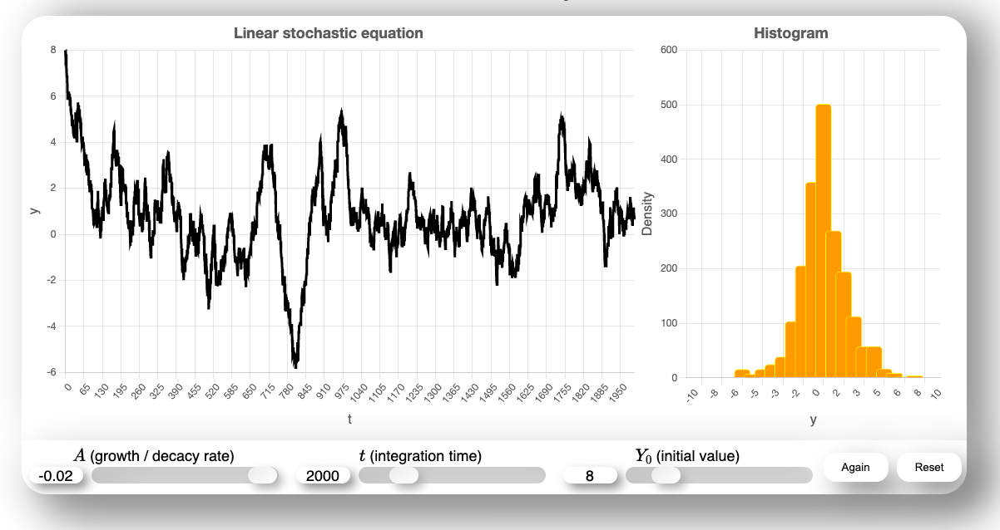
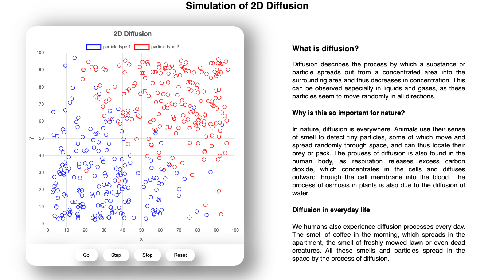

# [Random Systems Website](https://btschwertfeger.github.io/Random-Systems-Website/)

Seemingly random processes are everywhere, so it is important not to take them for granted, but to understand them. To make this a little easier, this website has been created to provide material for teachers and students.

Linear stochastic equation:

2-dimensional diffsion:

... and more

## Availability:

- [https://btschwertfeger.github.io/Random-Systems-Website/](https://btschwertfeger.github.io/Random-Systems-Website/)
- [https://www.awi.de/ ....](https://www.awi.de/fileadmin/user_upload/AWI/Forschung/Klimawissenschaft/Dynamik_des_Palaeoklimas/RandomSystems/index.html)
